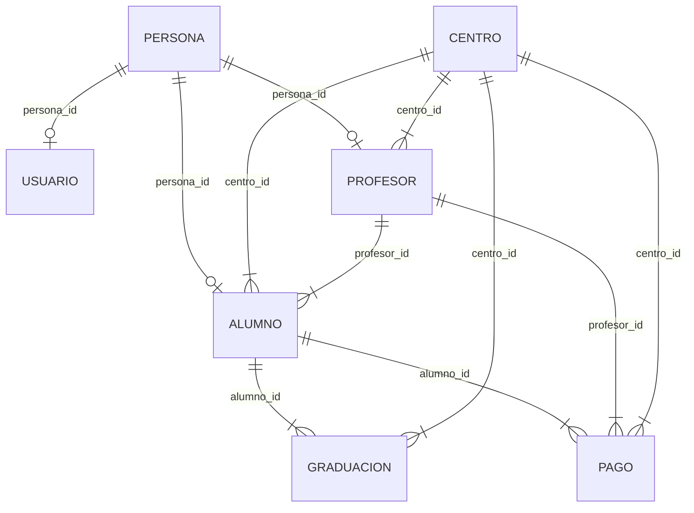

# BACKEND:

## 🛠️ Tech Stack (Backend & Base de Datos)

* **Lenguaje:** Python 3.x
* **Framework Web:** Flask
* **Base de Datos:** MySQL
* **Entorno de Servidor Local:** XAMPP (Apache + MySQL / phpMyAdmin)
* **Conector BD:** `mysql-connector-python`

---

# FRONTEND:

* ** HTML + CSS + JS**
* sitio placeholder: https://eliasescalante.github.io/CRM-Practica-Profesionalizante-Academia/

# Modelo DB de CRM

### Conexiones de Foreign Keys (Relaciones)

#### Entidades Base y Accesos
* **`persona` $\rightarrow$ `usuario`**
  * `persona.id` (PK) $\longrightarrow$ `usuario.persona_id` (FK) `[1 : 0..1]`
* **`persona` $\rightarrow$ `profesor`**
  * `persona.id` (PK) $\longrightarrow$ `profesor.persona_id` (FK) `[1 : 0..1]`
* **`persona` $\rightarrow$ `alumno`**
  * `persona.id` (PK) $\longrightarrow$ `alumno.persona_id` (FK) `[1 : 0..1]`

#### Estructura Operativa y Sedes
* **`centro` $\rightarrow$ `profesor`**
  * `centro.id` (PK) $\longrightarrow$ `profesor.centro_id` (FK) `[1 : N]`
* **`centro` $\rightarrow$ `alumno`**
  * `centro.id` (PK) $\longrightarrow$ `alumno.centro_id` (FK) `[1 : N]`
* **`profesor` $\rightarrow$ `alumno`**
  * `profesor.id` (PK) $\longrightarrow$ `alumno.profesor_id` (FK) `[1 : N]`

#### Graduaciones
* **`alumno` $\rightarrow$ `graduacion`**
  * `alumno.id` (PK) $\longrightarrow$ `graduacion.alumno_id` (FK) `[1 : N]`
* **`centro` $\rightarrow$ `graduacion`**
  * `centro.id` (PK) $\longrightarrow$ `graduacion.centro_id` (FK) `[1 : N]`

#### Pagos y Transacciones
* **`alumno` $\rightarrow$ `pago`**
  * `alumno.id` (PK) $\longrightarrow$ `pago.alumno_id` (FK) `[1 : N]`
* **`profesor` $\rightarrow$ `pago`**
  * `profesor.id` (PK) $\longrightarrow$ `pago.profesor_id` (FK) `[1 : N]`
* **`centro` $\rightarrow$ `pago`**
  * `centro.id` (PK) $\longrightarrow$ `pago.centro_id` (FK) `[1 : N]`

---

#### Diagrama de Entidad-Relaciones

